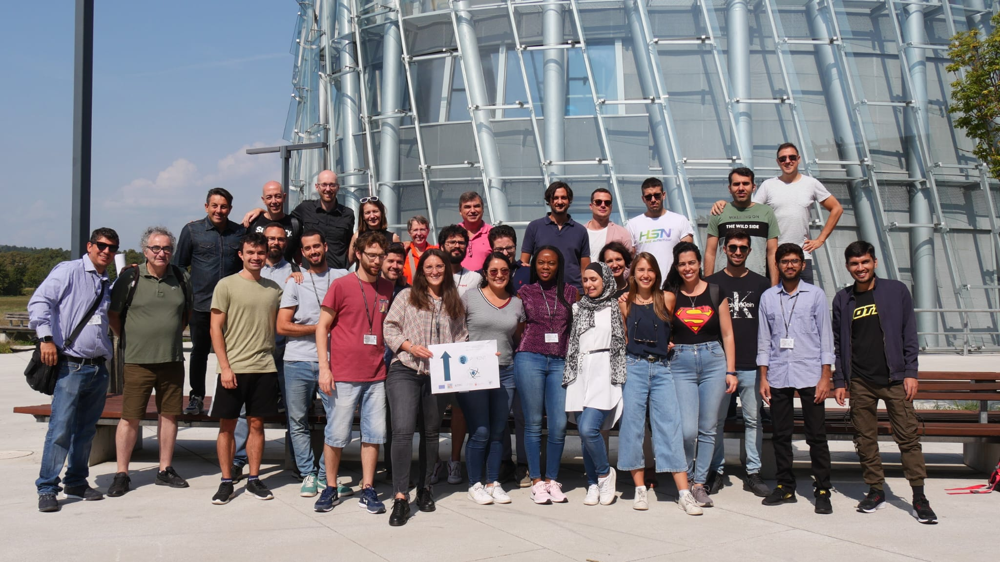

# MSCA-ITN-PARENT
This repository contains the material of the summer schools of the EU project [PARENT](https://parenth2020.com).

## DETERMINED 2022 Summer School (Ljubljana, Slovenia)

This folder contains the material for the lectures held at the DETERMINED 2022 summer school at the University of Ljubljana (financed by the European Project [PARENT](https://parenth2020.com)) held end of August 2022. Each folder contains material as presentations, code for the hands-on sessions and further reading material that students can consult even after the school has finished.
